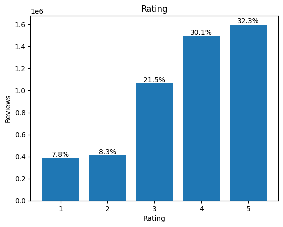
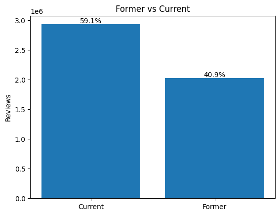
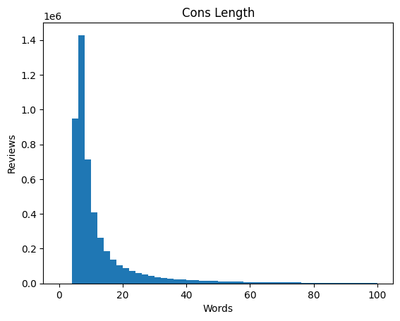
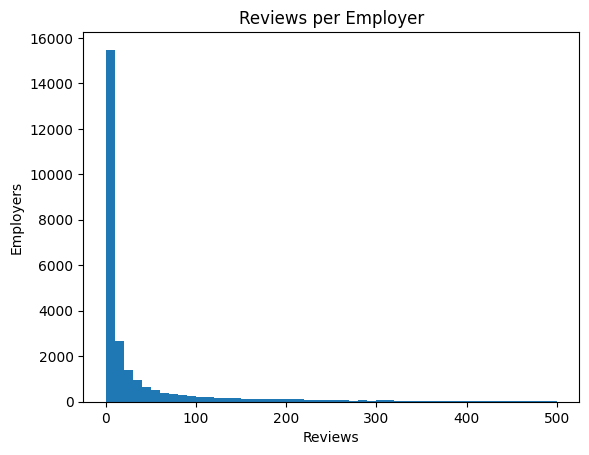

# Midterm Report Outline

## 1. Problem, Questions and Hypotheses

### 1.1 Decision Context

> I'm a data scientist at an **HR-tech company that builds AI tools for talent acquisition**.
>
> Our product team has to decide **whether the employer page should include a "What former employees say" and for which companies**.
>
> The data I have is **9.9 million Glassdoor reviews of about 35K employers (2008-2023), with rating, Cons text, tenure, and date**

Former and current employees may have different views, but their ratings are usually mixed into one average. We test whether that difference is large enough to show separately, and which employers have enough reviews to show it reliably.

### 1.2 Research Questions and Statistical Tasks

| RQ  | Question                                                                                           | Statistical Task                                        | Unit of Analysis | Decides                                                     |
| :-- | :------------------------------------------------------------------------------------------------- | :------------------------------------------------------ | :--------------- | :---------------------------------------------------------- |
| RQ1 | Within the same company, do former and current employees rate differently?                         | Estimation (mean gap with 95% CI)                       | Employer         | Whether there is a meaningful rating gap to investigate     |
| RQ2 | At the same rating, does Cons text still distinguish former from current, and what words drive it? | Binary classification (TF-IDF logistic regression, AUC) | Review           | What the section shows (themes and quotes, or ratings only) |
| RQ3 | How many reviews are needed to trust a former vs current rating gap?                               | Sample size analysis (resampling)                       | Employer         | Which employers can show the section                        |

All three questions measure association between employment status and reviews. **We do not claim that leaving an employer causes lower ratings**.

### 1.3 Hypotheses

| Hypothesis | Expected                                                                                         | Rejected if                                                                                      |
| :--------- | :----------------------------------------------------------------------------------------------- | :----------------------------------------------------------------------------------------------- |
| H1         | Former employees rate their employer lower than current employees, even within the same company. | The 95% CI of the average within-employer gap (former minus current) includes 0 or lies above 0. |
| H2a        | Within the same employer and rating, Cons text still helps tell former from current reviewers.   | The 95% CI of the AUC includes 0.5.                                                              |
| H2b        | "Management" is among the top 20 words pointing to former.                                       | "Management" is not in the top 20.                                                               |
| H3         | More than half of employers do not have enough reviews to trust their gap.                       | At least half of employers have at least n\* reviews in both groups.                             |

## 2. Data and Sample

### 2.1 How the Data Were Generated

The data was scraped from Glassdoor, an online job search and career community platform and shared on Kaggle.
Original Dataset: [Glassdoor Job Reviews 2](https://www.kaggle.com/datasets/davidgauthier/glassdoor-job-reviews-2)
Licence: [CC BY-NC-SA 4.0](https://creativecommons.org/licenses/by-nc-sa/4.0/)

It has 9.9M rows with numerical, categorical, text, and time series data.
Reviews are voluntary and status is self-reported

### 2.2 Target Population and Observed Sample

The distribution of the target population and extracted sample are potentially distinct since the sample is composed of only those who choose to write.
The number who decided to post their reviews is much less than the population. There are many kinds of complaints about companies that aren't shown here. For example, the reason regarding employees' privacy. In addition, some groups may be overrepresented in the data, such as former employees who left unhappy and current employees whose employer encouraged them to post.
Therefore, we must acknowledge this kind of limitation before analysis.

### 2.3 Duplicated, Repeated and Missing Observations

**Duplicates**
We dropped rows that were identical on title, rating, status, Pros, Cons, company ID, date and job. This removed 435,648 rows (4.4% of all).

```python
key = ["title", "rating", "status", "pros", "cons", "firm_id", "date", "job"]
df = df.drop_duplicates(subset=key)
```

**Repeated**
Reviews from the same employer share the same pay, managers and events, so their ratings tend to move together. We therefore keep each employer in a single data split. We cannot detect the same person reviewing twice because the data have no reviewer ID.

**Missing**
We dropped rows missing company ID, rating, status or date, which removed only 368 rows. We did not impute because so few rows were affected.

```python
df["former"] = status.str.extract(r"^(Current|Former) ")[0].map({"Current": 0, "Former": 1})
df["date"] = pd.to_datetime(df["date"], errors="coerce")
df["rating"] = pd.to_numeric(df["rating"], errors="coerce")
df = df.dropna(subset=["firm_id", "rating", "former", "date"])
```

### 2.4 Filtering

We kept only regular employees' reviews written in 2020 or later, which left 4,950,344 ones. We excluded 'interns' and 'contractors' because for them former often just means the contract ended, and they make up only 0.1% of reviews. We kept 2020 onward because this is the most recent period available in the dataset, and these reviews still make up over half of the data. Requiring at least 10 former and 10 current reviews leaves 8,539 employers with 98% of the reviews, and requiring at least 1,000 of each leaves 333 employers.

### 2.5 Distributions

|                                            |                                                              |
| :----------------------------------------: | :----------------------------------------------------------: |
|            |                   |
|  |  |

Most ratings are 4 or 5 (mean 3.71, median 4), and former employees rate 0.50 lower than current employees on average. Current employees write 59% of reviews and former employees 41%. Most Cons are short, with a median of 8 words. Reviews per employer are highly skewed (median 7, mean 178.5), and the 7% of employers with at least 183 reviews in each group hold 80% of all reviews.

## 3. Baselines

### 3.1 Baseline per Research Question

**RQ1.** The baseline is the pooled gap, the average former rating minus the average current rating across all reviews, ignoring employer. This gap is −0.50.

**RQ2.** The baseline is a word count model, a logistic regression on raw word counts in Cons.

**RQ3.** The baseline is a normal approximation. For a gap between two group means with n reviews each, requiring the 95% margin to be at most 0.25 gives

$$
n^* = 2\left(\frac{1.96\,\sigma}{0.25}\right)^2 = 183
$$

where σ = 1.22 is the standard deviation of ratings across all reviews in the sample.

### 3.2 Fair Comparison

| RQ  | Compared with                    | If different or better                              | If similar or worse        |
| :-- | :------------------------------- | :-------------------------------------------------- | :------------------------- |
| RQ1 | Pooled gap (−0.50)               | Employer mix was distorting the pooled gap          | The pooled gap is enough   |
| RQ2 | Word count model                 | TF-IDF weighting adds signal beyond raw word counts | Raw word counts are enough |
| RQ3 | Normal approximation (n\* = 183) | Use the resampling result                           | The formula is enough      |

## 4. Evaluation Design

### 4.1 RQ1: Rating Gap

For each employer with at least 10 former and 10 current reviews (8,539 employers), we compute the gap as the former mean rating minus the current mean rating. We then average these gaps across employers, giving each employer equal weight so that a few very large employers do not dominate the result. Comparing within an employer removes the effect of former and current reviewers coming from different mixes of employers, which the pooled gap includes. The 95% CI is computed by bootstrap resampling of employers, because employers rather than reviews are the independent units. To check that the result does not depend on the threshold of 10, we repeat the analysis with 5, 20 and 50 reviews per group. We treat a gap smaller than 0.25 points in absolute size as too small to matter to users, even if its CI excludes 0.

### 4.2 RQ2: Text Signal

We split employers into train, validation and test sets (64/16/20), so no employer appears in more than one set. Otherwise the model could learn employer-specific words, such as product names, and look better than it really is. The TF-IDF vocabulary and the logistic regression are fit on the training set only. The validation set is used to tune settings such as the regularization strength, and the test set is used once. Before fitting, we remove phrases that state the status outright, such as "I left" and "laid off". Past-tense wording such as "was" or "used to" can still reveal status, so we check whether such words appear among the top predictors. We evaluate on pairs of one former and one current review from the same test employer with the same rating. The AUC is the share of pairs in which the model gives the former review the higher score. We average the AUC across employers and compute its 95% CI by bootstrap resampling of test employers. The word count model is evaluated on the same pairs. Finally, we list the 20 words with the largest coefficients toward former to test whether "management" is among them.

### 4.3 RQ3: Reviews Needed

We use employers with at least 1,000 former and 1,000 current reviews as reference employers, and treat each one's full-data gap as its reference gap. This is a reference rather than the true gap, but with 1,000 reviews per group its own 95% margin is only about ±0.11 points. For each reference employer and each n from 50 to 300 in steps of 10, we draw n former and n current reviews separately with replacement and compute the gap, repeating this 1,000 times. We define n* as the smallest n at which 95% of draws, pooled across reference employers, fall within ±0.25 of the reference gap. The tolerance of 0.25 is half the pooled 0.50 gap, so an estimate this close cannot flip the sign of a typical gap, and the 95% level matches the confidence level used elsewhere. We repeat the analysis with tolerances of 0.20 and 0.30 and a 90% level to see how much n* changes.

## 5. Preliminary Results, Supported and Limited Claims

### 5.1 Preliminary Results

Across all reviews, former employees rate their employer 0.50 points lower than current employees (pooled gap −0.50). This is twice the 0.25 points we treat as the smallest gap that matters to users, although the pooled gap ignores differences between employers. Under the normal approximation, an employer needs at least 183 former and 183 current reviews to estimate its gap within ±0.25. Only 6.7% of employers in the filtered sample meet this bar, but they hold 80.1% of all reviews. This is consistent with H3, since far more than half of employers lack enough reviews.

### 5.2 Supported vs Limited Claims

| What we can claim now                                                                                      | What we cannot claim that                                                     |
| :--------------------------------------------------------------------------------------------------------- | :---------------------------------------------------------------------------- |
| Across all reviews, former employees rate 0.50 points lower than current employees                         | This gap reflects all employees, since reviewers choose to post               |
| Reviews are concentrated in few employers (median 7 per employer, 6.7% of employers hold 80.1% of reviews) | Status is accurate, since reviewers select it themselves                      |
| Under the normal approximation, 93.3% of employers have fewer than 183 reviews in at least one group       | Leaving an employer causes lower ratings, since we measure association only   |
|                                                                                                            | Our thresholds (10 reviews, n\* = 183, ±0.25) are the only reasonable choices |
|                                                                                                            | The results hold beyond Glassdoor employees from 2020 onward                  |

## 6. Next Steps and Decision Rule

### 6.1 Next Steps

- Run the main methods and compare them with the baselines
- Check n\* = 183 against resampling
- Run sensitivity checks on the thresholds
- Check the RQ1 gap within tenure bands

### 6.2 Decision Rule

- How RQ1 to RQ3 combine into use, conditional use, hold or reject
- Which employers the recommendation applies to
